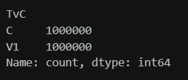
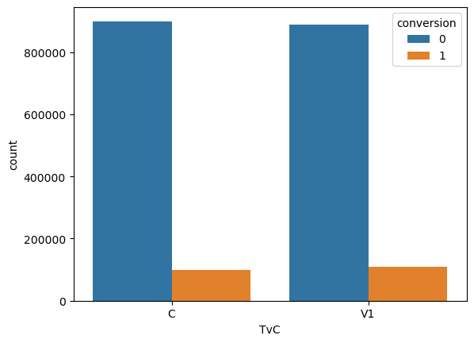
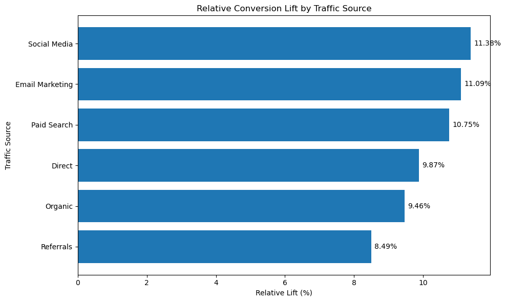

  
  
  
  
  

# 🧪 A/B Testing for E-Commerce Conversion Optimization

This project applies experimentation, hypothesis testing, and statistical analysis techniques to evaluate whether a new user experience version (V1) can improve conversion rates compared to the current version (Control).

The study combines Exploratory Data Analysis (EDA), Chi-Square Testing, Logistic Regression, complementary statistical tests, and traffic source segmentation analysis to generate business-oriented recommendations.

---

## 🎯 The Problem

Companies frequently run A/B experiments to validate product changes before rolling them out to all users.

However, not every observed difference between groups represents a real improvement.

Statistical methods are required to determine whether the observed results are significant or could have occurred by chance.

This project investigates whether version V1 produces a meaningful increase in conversion rates compared to the Control version.

---

## 🚀 Overview

Main question:

> Does the new user experience version (V1) significantly increase conversion rates compared to the current version (Control)?

To answer this question, classical experimentation and statistical inference techniques were applied.

---

## 🧪 Approach

The project combines:

* Exploratory Data Analysis (EDA)
* Chi-Square Test
* Independent Samples t-Test
* Levene's Test
* Welch's Test
* Logistic Regression
* Traffic Source Segmentation Analysis
* Conversion Lift Evaluation

The goal is not only to verify statistical significance but also to evaluate the business impact of the new version.

---

## 🎯 Objectives

* Evaluate whether a significant difference exists between Control and V1.
* Measure the impact of the new version on conversion rates.
* Validate findings using multiple statistical approaches.
* Investigate whether the treatment effect is consistent across traffic sources.
* Translate statistical findings into business recommendations.

---

## 🧠 Methodology

### 🔹 1. Data Exploration

The dataset was analyzed to identify:

* Missing values
* Duplicate records
* Experimental group distribution
* Conversion distribution
* Potential inconsistencies

---

### 🔹 2. Data Quality Assessment

During exploratory analysis, approximately 94.8% of the records were found to contain repeated attribute combinations.

Because the dataset does not include unique user identifiers, it was not possible to determine whether these repetitions represent redundant observations or distinct users with similar characteristics.

This limitation was considered during the interpretation of the results.

---

### 🔹 3. Chi-Square Test

The Chi-Square Test was used to evaluate the association between:

* Experimental Group (Control or V1)
* Conversion Outcome (0 or 1)

The objective was to determine whether conversion rates differed significantly between groups.

---

### 🔹 4. Complementary Statistical Tests

Although the conversion variable is binary and the Chi-Square Test does not require normality assumptions, additional analyses were performed to better understand the data distribution.

The following tests were applied:

* Shapiro-Wilk Test
* Q-Q Plot Analysis
* Levene's Test
* Welch's Test

These analyses were exploratory in nature and provided additional validation of the results.

---

### 🔹 5. Logistic Regression

Logistic Regression was used as a complementary approach to the Chi-Square Test.

The model enabled the evaluation of the impact of version V1 on the probability of user conversion.

---

### 🔹 6. Traffic Source Analysis

After identifying a positive overall effect of V1, the analysis investigated whether this impact remained consistent across different acquisition channels.

The following traffic sources were evaluated:

* Organic
* Direct
* Referrals
* Email Marketing
* Paid Search
* Social Media

---

## 📊 Analysis and Results

### 📌 Experimental Group Distribution

**Insight**

The Control and Treatment groups were evenly distributed, reducing potential sampling bias.

---

### 📌 Conversion Rate by Group

| Group   | Conversion Rate |
| ------- | --------------: |
| Control |          10.01% |
| V1      |          10.99% |

**Insight**

Version V1 achieved an absolute increase of approximately 0.98 percentage points in conversion rate.

---

### 📌 Conversion Lift by Traffic Source

| Traffic Source  | Relative Lift |
| --------------- | ------------: |
| Social Media    |        11.38% |
| Email Marketing |        11.09% |
| Paid Search     |        10.75% |
| Direct          |         9.87% |
| Organic         |         9.46% |
| Referrals       |         8.49% |

**Insight**

A positive treatment effect was observed across all traffic sources, suggesting that the impact of V1 was not restricted to a single user segment.

---

### 📌 Statistical Results

| Statistic            |          Result |
| -------------------- | --------------: |
| Chi-Square Statistic |          510.10 |
| p-value              | ≈ 6.03 × 10⁻¹¹³ |

**Insight**

The statistical tests provided sufficient evidence to reject the null hypothesis, indicating a significant association between the displayed version and conversion outcome.

---

## 🤖 Validation

The robustness of the analysis was evaluated using:

* Chi-Square Test
* Independent Samples t-Test
* Levene's Test
* Welch's Test
* Logistic Regression
* Traffic Source Segmentation Analysis

Results remained consistent across multiple statistical approaches.

---

## 🧠 Key Findings

* Version V1 achieved a higher conversion rate than the Control group.
* The relative conversion increase was approximately 9.78%.
* All traffic sources showed positive gains.
* Social Media and Email Marketing produced the highest observed lifts.
* Results remained consistent across multiple statistical methods.
* The observed treatment effect is highly unlikely to have occurred by chance.

---

## 🚀 Project Highlights

* 🔥 Practical application of A/B Testing.
* 📊 Statistical inference using the Chi-Square Test.
* 🧠 Logistic Regression modeling.
* 📈 Absolute and Relative Lift evaluation.
* 🎯 Traffic Source Segmentation Analysis.
* ✅ Translation of statistical results into business recommendations.

---

## 🛠️ Technologies Used

* Python
* Pandas
* NumPy
* Matplotlib
* Seaborn
* SciPy
* Statsmodels
* Scikit-Learn

---

## 🏁 Conclusion

The analysis demonstrated that version V1 outperformed the Control group, increasing the conversion rate from approximately 10.01% to 10.99%.

The statistical tests provided sufficient evidence to reject the null hypothesis, indicating that the observed difference was highly unlikely to have occurred by chance.

Traffic source segmentation further reinforced these findings, showing consistent positive gains across all acquisition channels.

The results suggest that implementing V1 could generate meaningful improvements in business performance.

---

## 📌 Limitations

* The dataset does not contain unique user identifiers.
* It was not possible to verify whether repeated records represent distinct users or redundant observations.
* Results should be interpreted within the context of the analyzed experiment.
* Additional behavioral factors not present in the dataset may influence conversion outcomes.

---

## 👨‍💻 Author

Developed by **Brener Souza**

Data Science Student | Salesforce Administration | CRM & Analytics
