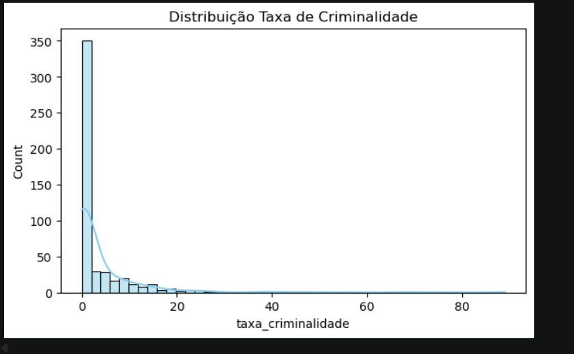
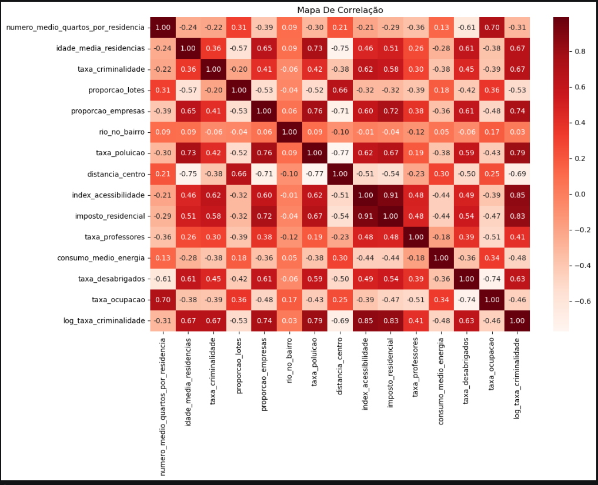
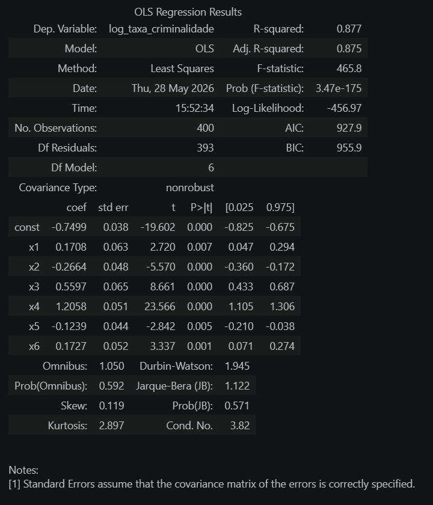

  
  
  
  

# 🚔 Análise da Taxa de Criminalidade com Regressão Linear Múltipla

Este projeto aplica técnicas de modelagem estatística para investigar quais fatores socioeconômicos, demográficos e urbanos influenciam a taxa de criminalidade.

O estudo combina Análise Exploratória de Dados (EDA), análise de correlação, regressão linear múltipla e validação dos pressupostos estatísticos para construir um modelo interpretável e estatisticamente confiável.

---
---

## 📌 Problema de Negócio

Gestores públicos e planejadores urbanos frequentemente precisam compreender quais fatores socioeconômicos e urbanos estão associados ao aumento das taxas de criminalidade para apoiar decisões e direcionamento de recursos.

No entanto, a criminalidade é influenciada por diversas variáveis interligadas, tornando difícil identificar quais fatores realmente contribuem para as variações observadas.

Utilizando Regressão Linear Múltipla, análise de correlação e diagnósticos estatísticos, este projeto investigou se variáveis socioeconômicas e urbanas poderiam explicar os padrões observados na taxa de criminalidade por meio de um modelo estatisticamente confiável.

### 📈 Principais Resultados

✅ Modelo final alcançou aproximadamente **R² = 0,86**

✅ Cerca de **86% da variabilidade da criminalidade** foi explicada pelas variáveis selecionadas

✅ Problemas de multicolinearidade foram identificados e tratados com análise VIF

✅ Os principais pressupostos estatísticos foram validados

✅ O modelo final apresentou forte capacidade explicativa e interpretabilidade

---

## 💼 Impacto para o Negócio

* Identificação de fatores associados à variação das taxas de criminalidade.
* Demonstração da importância da seleção adequada de variáveis.
* Construção de um modelo estatisticamente validado para apoio à tomada de decisão.
* Utilização de indicadores socioeconômicos e urbanos para compreensão dos padrões de criminalidade.
* Aplicação prática de modelagem estatística combinada com validação rigorosa dos resultados.

## 🎯 O Problema

A criminalidade é influenciada por diversos fatores interligados, tornando difícil identificar quais variáveis realmente contribuem para o aumento ou redução das taxas de crime.

Compreender essas relações é importante para gestores públicos, planejadores urbanos e organizações que buscam desenvolver políticas mais eficientes para prevenção e segurança.

Este projeto investiga se variáveis socioeconômicas e urbanas podem explicar as variações observadas na taxa de criminalidade por meio de modelagem estatística.

---

## 🚀 Visão Geral

Pergunta principal:

> É possível explicar as variações da taxa de criminalidade utilizando variáveis socioeconômicas e urbanas por meio de um modelo estatístico validado?

Para responder essa pergunta, foram construídos, refinados e validados modelos de regressão utilizando técnicas clássicas de diagnóstico estatístico.

---

## 🧪 Abordagem

O projeto combina:

* Análise Exploratória de Dados (EDA)
* Análise de Correlação
* Regressão Linear Múltipla
* Transformação Logarítmica
* Variance Inflation Factor (VIF)
* Rainbow Test
* Durbin-Watson Test
* Breusch-Pagan Test
* Goldfeld-Quandt Test
* Shapiro-Wilk Test

O objetivo não é apenas construir um modelo preditivo, mas garantir que os pressupostos necessários para inferência estatística confiável sejam atendidos.

---

## 🎯 Objetivos

* Identificar fatores associados à taxa de criminalidade.
* Avaliar relações entre variáveis socioeconômicas.
* Construir um modelo de regressão interpretável.
* Diagnosticar problemas de multicolinearidade.
* Validar os pressupostos da regressão linear.
* Avaliar a confiabilidade do modelo por meio de testes estatísticos.

---

## 🧠 Metodologia

### 🔹 1. Exploração dos Dados

O conjunto de dados foi analisado para identificar:

* Valores ausentes
* Distribuição das variáveis
* Possíveis outliers
* Padrões estatísticos
* Relações entre atributos

---

### 🔹 2. Análise de Correlação

Foi utilizada a correlação de Pearson para investigar relações entre as variáveis do conjunto de dados.

### 📌 Principais Relações Observadas

Foram identificadas correlações relevantes entre diversos atributos, indicando possíveis problemas de multicolinearidade.

Exemplos:

* Idade × Poluição
* Quartos × Ocupação
* Empresas × Impostos
* Distância × Idade

---

### 🔹 3. Regressão Linear Múltipla

Foi desenvolvido um modelo inicial de Regressão Linear Múltipla para explicar a variação da taxa de criminalidade.

Posteriormente, o modelo passou por refinamentos e seleção de variáveis para melhorar sua estabilidade e capacidade explicativa.

---

### 🔹 4. Diagnóstico de Multicolinearidade

Foi aplicada a técnica Variance Inflation Factor (VIF) para identificar variáveis altamente correlacionadas.

Variáveis problemáticas foram removidas para aumentar a robustez e interpretabilidade do modelo.

---

### 🔹 5. Validação dos Pressupostos Estatísticos

Foram realizados diversos testes para avaliar a qualidade do modelo.

#### Rainbow Test

Utilizado para verificar a linearidade do modelo.

#### Durbin-Watson Test

Utilizado para avaliar a independência dos resíduos.

**Resultado:** aproximadamente 1,94, indicando ausência de autocorrelação significativa.

#### Breusch-Pagan Test

Aplicado para verificar homocedasticidade.

#### Goldfeld-Quandt Test

Utilizado como diagnóstico complementar para heterocedasticidade.

#### Shapiro-Wilk Test

Aplicado para avaliar a normalidade dos resíduos.

**Resultado:** p-value ≈ 0,1525.

Não foram encontradas evidências suficientes para rejeitar a hipótese de normalidade.

---

## 📊 Análises e Resultados

### 📌 Distribuição da Variável Alvo

**Insight**

A variável alvo apresentou assimetria, motivando a aplicação de transformação logarítmica para melhorar a adequação do modelo.

---

### 📌 Análise de Correlação

**Insight**

A análise revelou relações importantes entre variáveis explicativas e destacou potenciais problemas de multicolinearidade.

---

### 📌 Modelo de Regressão

**Insight**

O modelo final apresentou forte capacidade explicativa e atendeu aos principais pressupostos necessários para inferência estatística.

---

## 🤖 Validação

A qualidade do modelo foi avaliada por meio de:

* R²
* Análise de Resíduos
* Diagnóstico de Multicolinearidade
* Testes de Homocedasticidade
* Testes de Normalidade
* Testes de Independência dos Resíduos

### 📌 Desempenho Final

* R² ≈ 0,86

Isso significa que aproximadamente 86% da variabilidade observada na taxa de criminalidade pode ser explicada pelas variáveis selecionadas no modelo.

---

## 🧠 Principais Descobertas

* Fatores socioeconômicos apresentam influência significativa sobre a criminalidade.
* Diversas variáveis apresentaram problemas iniciais de multicolinearidade.
* A seleção de variáveis aumentou a estabilidade do modelo.
* Os pressupostos estatísticos foram satisfatoriamente atendidos.
* O modelo final explicou aproximadamente 86% da variabilidade da taxa de criminalidade.

---

## 🚀 Destaques do Projeto

* 🔥 Aplicação completa de Regressão Linear Múltipla.
* 📊 Análise de correlação e multicolinearidade.
* 🧠 Utilização de VIF para seleção de variáveis.
* 📈 Validação estatística completa do modelo.
* ✅ Aplicação dos testes Durbin-Watson, Breusch-Pagan, Goldfeld-Quandt e Shapiro-Wilk.
* 🎯 Forte capacidade explicativa (R² ≈ 0,86).

---

## 🛠️ Tecnologias Utilizadas

* Python
* Pandas
* NumPy
* Matplotlib
* Seaborn
* Statsmodels
* SciPy
* Scikit-Learn

---

## 🏁 Conclusão

Os resultados demonstram que a taxa de criminalidade pode ser explicada de forma consistente por meio de um modelo de Regressão Linear Múltipla quando são aplicados procedimentos adequados de diagnóstico e validação estatística.

O modelo final apresentou forte capacidade explicativa e atendeu aos principais pressupostos necessários para inferências confiáveis.

Este projeto demonstra a importância de combinar modelagem preditiva e validação estatística para obter análises mais robustas e interpretáveis.

---

## 📌 Limitações

* A análise está limitada às variáveis disponíveis no conjunto de dados.
* Correlação não implica causalidade.
* Fatores sociais e econômicos não presentes no dataset podem influenciar a criminalidade.
* Os resultados devem ser interpretados dentro do contexto específico da população analisada.

---

## 👨‍💻 Autor

Desenvolvido por **Brener Souza**

Data Science Student | Salesforce Administration | CRM & Analytics
