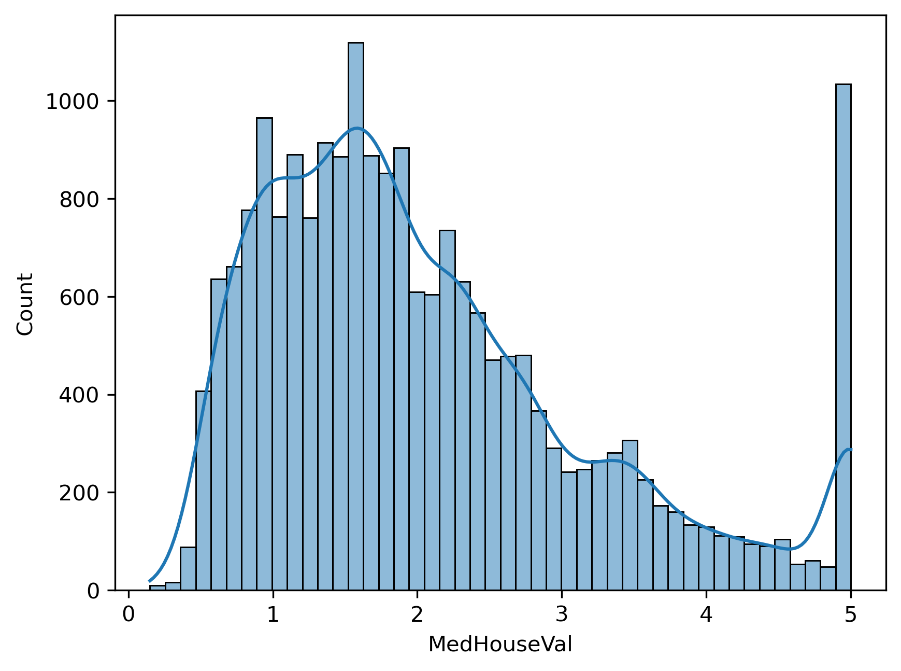
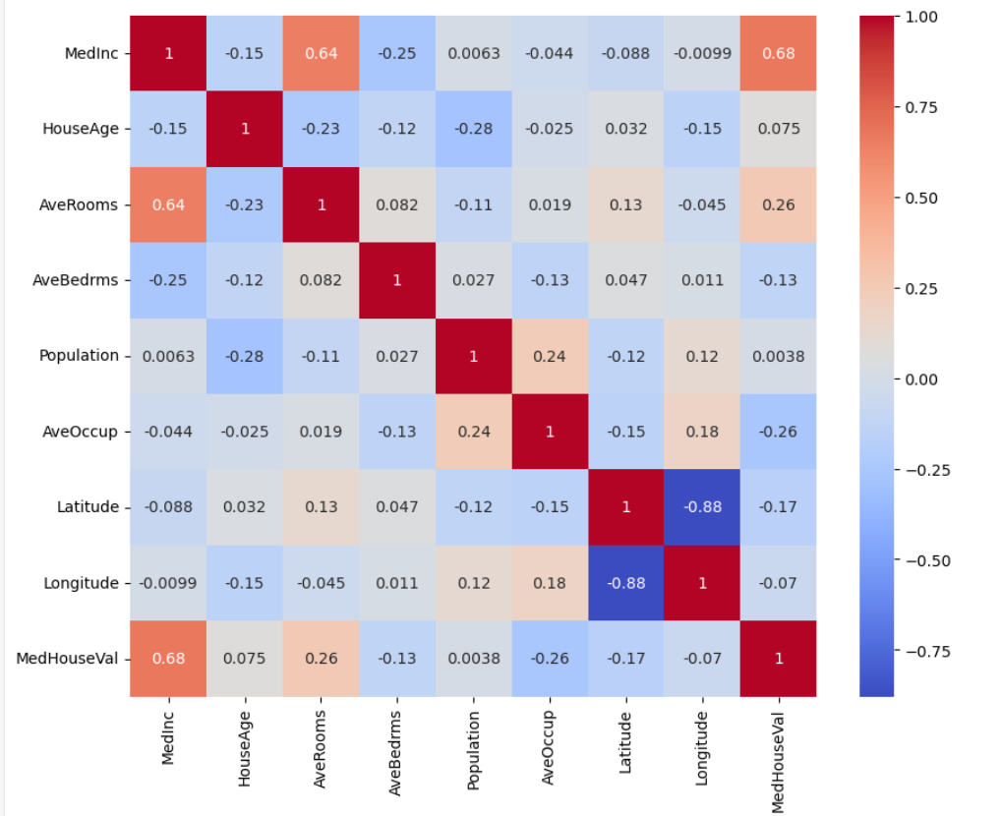
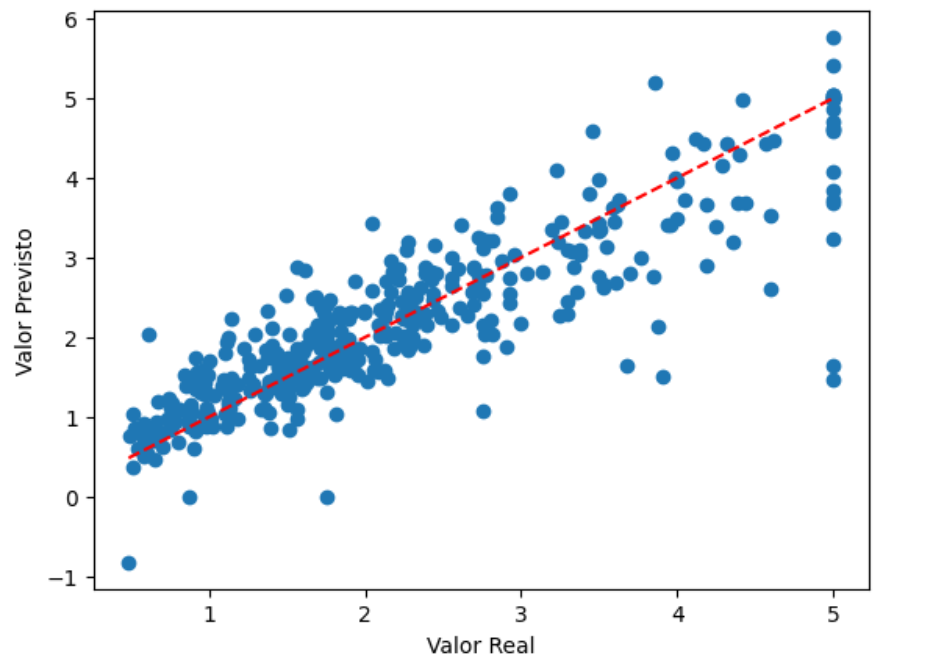
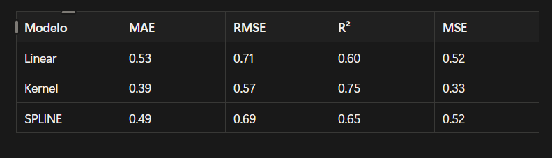

  
  
  
  

# 🎯 Housing Price Prediction using Nonparametric Regression

This project applies nonparametric regression techniques and statistical inference methods to predict housing prices using the California Housing Dataset.

The study compares Linear Regression, Spline Regression, and Kernel Regression while also investigating statistical differences between property groups and geographic regions.

---

## 🎯 The Problem

Real estate companies need to understand which factors influence housing prices and whether location and property characteristics significantly affect market value.

Traditional linear models may fail to capture complex nonlinear relationships present in real-world housing data.

This project investigates whether nonparametric methods can provide better predictive performance and additional statistical insights.

---

## 🚀 Overview

Main question:

> Can nonparametric regression models capture housing price patterns better than traditional linear regression?

To answer this question, multiple regression approaches were evaluated and compared using predictive performance metrics and nonparametric statistical tests.

---

## 🧪 Approach

The project combines:

* Exploratory Data Analysis (EDA)
* Spearman Correlation Analysis
* Linear Regression (Baseline)
* Spline Regression
* Kernel Regression
* Mann-Whitney Test
* Kruskal-Wallis Test

The goal is not only to predict prices but also to understand how housing characteristics and geographic location affect property valuation.

---

## 🎯 Objectives

* Predict housing prices using different regression approaches.
* Compare linear and nonparametric models.
* Identify important relationships between variables.
* Investigate statistically significant differences between groups.
* Evaluate the influence of geographic location on housing prices.

---

## 🧠 Methodology

### 🔹 1. Data Exploration

The California Housing Dataset was analyzed to identify:

* Missing values
* Duplicates
* Distribution patterns
* Potential outliers
* Variable correlations

---

### 🔹 2. Correlation Analysis

Spearman correlation was used to evaluate monotonic relationships between variables.

### 📌 Key Relationships

* MedInc × MedHouseVal → 0.68
* AveRooms × AveBedrms → 0.84
* Latitude × Longitude → -0.92

---

### 🔹 3. Baseline Model

A Multiple Linear Regression model was developed as a benchmark for comparison against nonparametric approaches.

---

### 🔹 4. Nonparametric Models

#### Spline Regression

Used to model nonlinear relationships through spline transformations.

#### Kernel Regression

Applied to capture complex nonlinear patterns without assuming a predefined functional form.

---

### 🔹 5. Statistical Tests

#### Mann-Whitney Test

Compared housing prices between:

* Newer properties
* Older properties

#### Kruskal-Wallis Test

Compared housing prices across geographic regions created using K-Means clustering based on latitude and longitude.

---

## 📊 Analyses and Results

### 📌 Target Distribution

**Insight**

The target variable presents a right-skewed distribution, suggesting that nonlinear methods may be advantageous.

---

### 📌 Spearman Correlation Heatmap

**Insight**

Median income (MedInc) showed the strongest positive association with housing prices.

---

### 📌 Kernel Regression Predictions

**Insight**

Kernel Regression produced predictions closer to actual values compared to the baseline model.

---

### 📌 Model Performance Comparison

---

## 🤖 Validation

Model performance was evaluated using:

* MAE (Mean Absolute Error)
* RMSE (Root Mean Squared Error)
* MSE (Mean Squared Error)
* R² Score

Additionally, Kernel Regression stability was assessed using K-Fold Cross Validation due to the computational cost of bootstrap resampling.

---

## 🧠 Main Findings

* Kernel Regression achieved the best predictive performance.
* Median income showed the strongest relationship with housing prices.
* Housing prices differ significantly between newer and older properties.
* Geographic location significantly influences housing valuation.
* Nonparametric methods captured complex patterns more effectively than linear regression.

---

## 🚀 Project Highlights

* 🔥 Comparison between parametric and nonparametric regression methods.
* 📊 Integration of predictive modeling and statistical inference.
* 🧠 Application of Mann-Whitney and Kruskal-Wallis tests.
* 🌎 Geographic segmentation using K-Means clustering.

---

## 🛠️ Technologies Used

* Python
* Pandas
* NumPy
* Matplotlib
* Seaborn
* Scikit-Learn
* Statsmodels
* SciPy

---

## 🏁 Conclusion

The results demonstrate that nonparametric regression techniques can outperform traditional linear regression when modeling complex housing price relationships.

Kernel Regression achieved the strongest predictive performance, while statistical tests confirmed that both property age and geographic location are associated with significant differences in housing prices.

This project highlights the value of combining predictive modeling with statistical inference to better understand real-world business problems.

---

## 📌 Limitations

* Kernel Regression required a reduced sample size due to computational cost.
* Geographic regions were created through clustering because the dataset does not contain an explicit region variable.
* Results are specific to the California Housing Dataset.

---

## 👨‍💻 Author

Developed by **Brener Souza**

Data Science Student | Salesforce Administrator | Data Analytics Enthusiast
