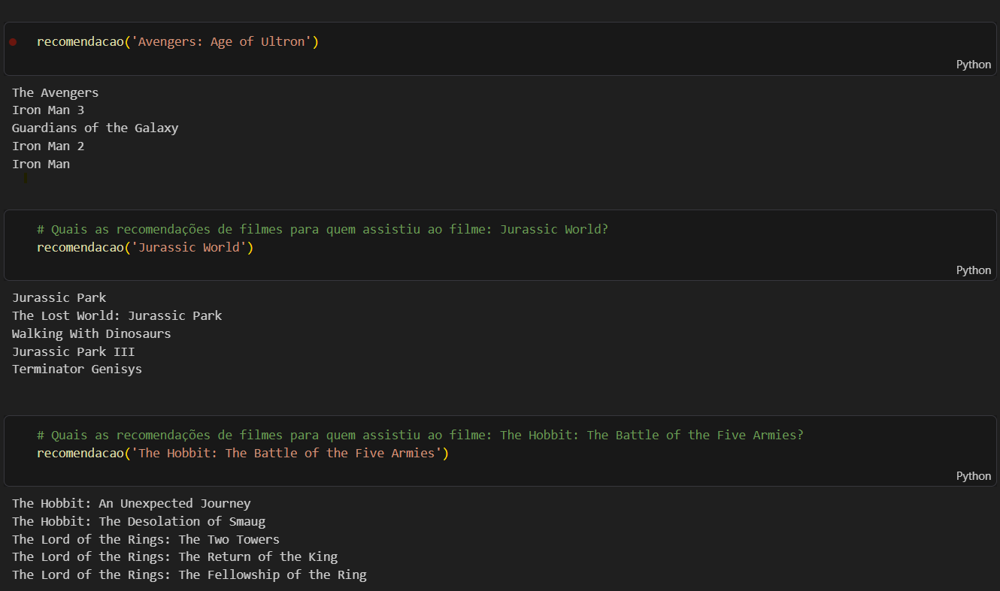

# NLP Movie Recommendation System | Sistema de Recomendação de Filmes com NLP

  
  
  

## 🎯 The Problem / O Problema

**🇺🇸 English:** Streaming platforms and content libraries face a major challenge: **User Retention**. With thousands of titles available, users often spend more time searching than watching. This project solves this by creating an automated engine that calculates content similarity, ensuring personalized suggestions and increasing platform engagement.

**🇧🇷 Português:** Plataformas de streaming enfrentam um grande desafio: **Retenção de Usuários**. Com milhares de títulos, o usuário perde mais tempo procurando do que assistindo. Este projeto resolve isso criando um mecanismo automatizado que calcula a similaridade entre conteúdos, garantindo sugestões personalizadas e aumentando o engajamento na plataforma.

---

## 🛠️ Tech Stack / Tecnologias

- **Language:** Python
- **Data:** Pandas & Numpy (Cleaning & Transformation)
- **Natural Language Processing (NLP):** NLTK (PorterStemmer) for word normalization.
- **Machine Learning:** Scikit-Learn (CountVectorizer for text-to-vector & Cosine Similarity for distance calculation).

---

## ⚙️ How it works / Como funciona

1. **Feature Engineering:** Combinamos dados de elenco, direção e gêneros em uma única "tag" de texto.
2. **Text Processing:** Aplicamos *Stemming* (ex: "loving" e "love" tornam-se a mesma raiz) para evitar duplicidade.
3. **Vectorization:** Transformamos as palavras em coordenadas matemáticas (vetores).
4. **Similarity:** O modelo encontra o filme mais "próximo" no espaço matemático através do cálculo de Cosseno.

---

## 📊 Results / Resultados

O sistema foi testado com sucesso. Ao buscar por **'The Hobbit: The Battle of the Five Armies'**, o modelo retornou corretamente:
1. The Hobbit: An Unexpected Journey
2. The Hobbit: The Desolation of Smaug
3. The Lord of the Rings: The Two Towers
... (e outros títulos da saga).

### 📈 System Validation / Validação do Sistema

| Input Movie (Filme de Entrada) | Top 5 Recommendations (Recomendações) |
| :--- | :--- |
| **The Hobbit: The Battle of the Five Armies** | 1. The Hobbit: An Unexpected Journey   2. The Hobbit: The Desolation of Smaug   3. The Lord of the Rings: The Two Towers   4. The Lord of the Rings: The Return of the King   5. The Lord of the Rings: The Fellowship of the Ring |

---