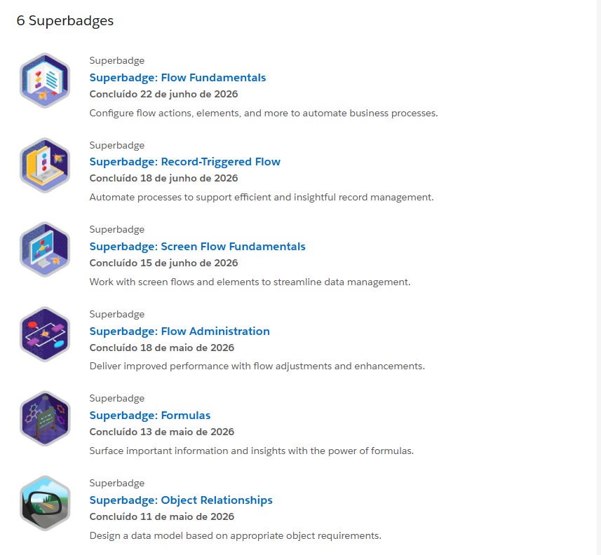

# 🎖️ Superbadges | Salesforce Superbadges

---

# 👨‍💻 Sobre Esta Seção | About This Section

## 🇧🇷 Português

Esta seção documenta minha evolução prática através das Superbadges do Salesforce Trailhead.

As Superbadges simulam cenários reais de negócio e exigem a aplicação prática de conhecimentos em Salesforce Administration, modelagem de dados, automação de processos e configuração da plataforma.

Diferentemente dos módulos tradicionais do Trailhead, as Superbadges são desafios práticos que exigem resolução de problemas e aplicação integrada de múltiplos conceitos do ecossistema Salesforce.

---

## 🇺🇸 English

This section documents my practical Salesforce learning journey through Trailhead Superbadges.

Superbadges simulate real-world business scenarios and require hands-on application of Salesforce Administration, data modeling, process automation, and platform configuration skills.

Unlike traditional Trailhead modules, Superbadges require solving business challenges by applying multiple Salesforce concepts in an integrated way.

---

# 📈 Status Atual | Current Status

## 🇧🇷 Português

### Conquistas Atuais

- Superbadges concluídas: 6
- Trilha atual: Flow Builder Specialist Path
- Foco atual: Salesforce Administration e Process Automation
- Objetivo: Ranger Rank e Salesforce Certified Administrator

---

## 🇺🇸 English

### Current Achievements

- Completed Superbadges: 6
- Current Path: Flow Builder Specialist Path
- Current Focus: Salesforce Administration and Process Automation
- Goal: Ranger Rank and Salesforce Certified Administrator

---

# 🏆 Superbadges Concluídas | Completed Superbadges

## 🔗 Object Relationships

**Concluída em:** 11 de maio de 2026  
**Completed:** May 11, 2026

### 🇧🇷 Português

Desenvolvimento de modelos de dados utilizando relacionamentos adequados entre objetos para atender a requisitos de negócio.

**Competências desenvolvidas:**

- Data Modeling
- CRM Architecture
- Object Relationships
- Lookup Relationships
- Master-Detail Relationships

### 🇺🇸 English

Designed a data model based on appropriate object relationships and business requirements.

**Skills developed:**

- Data Modeling
- CRM Architecture
- Object Relationships
- Lookup Relationships
- Master-Detail Relationships

---

## 🧮 Formulas

**Concluída em:** 13 de maio de 2026  
**Completed:** May 13, 2026

### 🇧🇷 Português

Utilização de fórmulas para apresentar informações importantes, automatizar cálculos e apoiar regras de negócio dentro da plataforma.

**Competências desenvolvidas:**

- Formula Fields
- Business Logic
- Data Validation
- CRM Configuration
- Data Quality

### 🇺🇸 English

Applied formulas to surface important information, automate calculations, and support business logic within Salesforce.

**Skills developed:**

- Formula Fields
- Business Logic
- Data Validation
- CRM Configuration
- Data Quality

---

## ⚡ Flow Administration

**Concluída em:** 18 de maio de 2026  
**Completed:** May 18, 2026

### 🇧🇷 Português

Administração e melhoria de fluxos existentes para aumentar desempenho, eficiência operacional e qualidade das automações.

**Competências desenvolvidas:**

- Flow Builder
- Process Automation
- Flow Administration
- Troubleshooting
- Performance Optimization

### 🇺🇸 English

Managed and improved existing Salesforce Flows to increase performance, operational efficiency, and automation quality.

**Skills developed:**

- Flow Builder
- Process Automation
- Flow Administration
- Troubleshooting
- Performance Optimization

---

## 🖥️ Screen Flow Fundamentals

**Concluída em:** 15 de junho de 2026  
**Completed:** June 15, 2026

### 🇧🇷 Português

Construção de Screen Flows e utilização de elementos de tela para simplificar a coleta, apresentação e gerenciamento de dados.

**Competências desenvolvidas:**

- Screen Flows
- Screen Elements
- User Interaction
- Data Collection
- Guided Processes
- User Experience

### 🇺🇸 English

Built Screen Flows and used screen elements to streamline data collection, presentation, and management.

**Skills developed:**

- Screen Flows
- Screen Elements
- User Interaction
- Data Collection
- Guided Processes
- User Experience

---

## 🔄 Record-Triggered Flow

**Concluída em:** 18 de junho de 2026  
**Completed:** June 18, 2026

### 🇧🇷 Português

Desenvolvimento de automações acionadas por alterações em registros para apoiar uma gestão mais eficiente e inteligente dos dados.

**Competências desenvolvidas:**

- Record-Triggered Flows
- Before-Save Flows
- After-Save Flows
- Record Management
- Process Automation
- Flow Optimization

### 🇺🇸 English

Developed record-triggered automations to support efficient and insightful record management.

**Skills developed:**

- Record-Triggered Flows
- Before-Save Flows
- After-Save Flows
- Record Management
- Process Automation
- Flow Optimization

---

## 🧩 Flow Fundamentals

**Concluída em:** 22 de junho de 2026  
**Completed:** June 22, 2026

### 🇧🇷 Português

Configuração de ações, elementos e recursos do Flow Builder para automatizar processos de negócio dentro do Salesforce.

**Competências desenvolvidas:**

- Flow Actions
- Flow Elements
- Decision Logic
- Variables and Resources
- Process Automation
- Flow Configuration

### 🇺🇸 English

Configured flow actions, elements, and resources to automate business processes within Salesforce.

**Skills developed:**

- Flow Actions
- Flow Elements
- Decision Logic
- Variables and Resources
- Process Automation
- Flow Configuration

---

# 🚀 Trilha Atual de Aprendizado | Current Learning Path

## Flow Builder Specialist Path

### Próximas Superbadges | Upcoming Superbadges

🔄 Scheduled Flow and Subflow

🔄 Screen Flow Distribution

🔄 Flow Data Collections Optimization

🔄 Flow Collections and Loops

🔄 Flow Error Handling

🔄 Flow Debugging

🔄 Flow Interactions

🔄 Flow Optimization

---

## 🇧🇷 Português

Atualmente estou aprofundando meus conhecimentos em automação com Salesforce Flow Builder, explorando fluxos agendados, subflows, distribuição de Screen Flows, coleções de dados, loops, tratamento de erros, depuração e otimização de desempenho.

---

## 🇺🇸 English

I am currently expanding my Salesforce Flow Builder automation skills, focusing on scheduled flows, subflows, Screen Flow distribution, data collections, loops, error handling, debugging, and performance optimization.

---

# 📸 Evidência Visual | Visual Evidence

### Superbadges Concluídas | Completed Superbadges

---

# 🧠 Competências Desenvolvidas | Skills Developed

Ao longo das Superbadges concluídas, desenvolvi experiência prática em:

### Salesforce Administration

- Platform Configuration
- User Experience
- Platform Customization
- Flow Administration

### Data Management

- Object Relationships
- Data Modeling
- Record Management
- Data Quality

### Process Automation

- Flow Builder
- Screen Flows
- Record-Triggered Flows
- Flow Actions and Elements
- Decision Logic
- Business Automation
- Process Optimization

### CRM Fundamentals

- Business Requirements Analysis
- Salesforce Best Practices
- Customer Relationship Management
- Process Design

---

# 🎯 Próximos Passos | Next Steps

## 🇧🇷 Português

- Concluir a Flow Builder Specialist Path.
- Avançar em Scheduled Flows, Subflows e tratamento de coleções.
- Aprofundar conhecimentos em depuração, tratamento de erros e otimização.
- Alcançar Ranger Rank.
- Desenvolver projetos próprios utilizando Salesforce Administration.
- Construir estudos de caso envolvendo CRM, automação e relatórios.
- Preparar-me para a certificação Salesforce Certified Administrator.

---

## 🇺🇸 English

- Complete the Flow Builder Specialist Path.
- Advance in Scheduled Flows, Subflows, and collection management.
- Expand knowledge of debugging, error handling, and optimization.
- Reach Ranger Rank.
- Develop original Salesforce Administration projects.
- Build CRM, automation, and reporting case studies.
- Prepare for the Salesforce Certified Administrator certification.

---

> 🇧🇷 Transformando processos de negócio em automações eficientes através do Salesforce.
>
> 🇺🇸 Turning business processes into efficient automations through Salesforce.