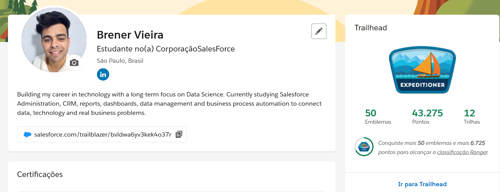

# 🏆 Trailhead Progress | Progresso no Trailhead

---

# 👨‍💻 Sobre Esta Jornada | About This Journey

## 🇧🇷 Português

Esta seção documenta minha evolução na plataforma Salesforce Trailhead.

Meu foco atual está no desenvolvimento de competências em Salesforce Administration, CRM, automação de processos, gestão de dados, relatórios e dashboards por meio de aprendizado prático, projetos guiados e Superbadges.

O Trailhead tem sido minha principal plataforma para desenvolver experiência prática com Salesforce e compreender como a tecnologia pode apoiar processos de negócio, automação e tomada de decisão.

---

## 🇺🇸 English

This section documents my progress on the Salesforce Trailhead platform.

My current focus is developing skills in Salesforce Administration, CRM, process automation, data management, reports, and dashboards through hands-on learning, guided projects, and Superbadges.

Trailhead has been my primary platform for building practical Salesforce experience and understanding how technology can support business processes, automation, and decision-making.

---

# 📈 Status Atual | Current Status

## 🇧🇷 Português

### Conquistas Atuais

- Rank: Expedition
- Emblemas conquistados: 59
- Pontos: 57.050
- Trilhas concluídas: 14
- Superbadges concluídas: 6
- Foco atual: Salesforce Administration e Flow Builder

### Próximos Objetivos

- Alcançar o Rank Ranger
- Concluir novas Superbadges
- Aprofundar conhecimentos em Salesforce Flow Builder
- Desenvolver projetos próprios em Salesforce
- Preparar-me para a certificação Salesforce Certified Administrator

---

## 🇺🇸 English

### Current Achievements

- Rank: Expedition
- Badges earned: 59
- Points: 57,050
- Completed Trails: 14
- Completed Superbadges: 6
- Current Focus: Salesforce Administration and Flow Builder

### Next Goals

- Achieve Ranger Rank
- Complete additional Superbadges
- Expand my Salesforce Flow Builder skills
- Develop original Salesforce projects
- Prepare for the Salesforce Certified Administrator certification

---

# 🏅 Destaques do Trailhead | Trailhead Highlights

- ✅ Expedition Rank
- ✅ 59 Emblemas conquistados | 59 Badges Earned
- ✅ 57.050 Pontos | 57,050 Points
- ✅ 14 Trilhas concluídas | 14 Completed Trails
- ✅ 6 Superbadges concluídas | 6 Completed Superbadges
- ✅ Experiência prática com CRM, Flow Builder, automação, modelagem de dados, relatórios e dashboards

---

# 📚 Áreas de Estudo | Learning Areas

## 🇧🇷 Português

Principais tópicos estudados até o momento:

- Salesforce Administration
- CRM Fundamentals
- Data Management
- Reports & Dashboards
- Security & Access Management
- Flow Builder
- Screen Flows
- Record-Triggered Flows
- Business Process Automation
- Data Modeling
- Formula Fields
- Lightning Experience

---

## 🇺🇸 English

Main topics studied so far:

- Salesforce Administration
- CRM Fundamentals
- Data Management
- Reports & Dashboards
- Security & Access Management
- Flow Builder
- Screen Flows
- Record-Triggered Flows
- Business Process Automation
- Data Modeling
- Formula Fields
- Lightning Experience

---

# 🎖️ Superbadges Concluídas | Completed Superbadges

- Object Relationships — 11 de maio de 2026
- Formulas — 13 de maio de 2026
- Flow Administration — 18 de maio de 2026
- Screen Flow Fundamentals — 15 de junho de 2026
- Record-Triggered Flow — 18 de junho de 2026
- Flow Fundamentals — 22 de junho de 2026

As Superbadges representam desafios práticos que simulam cenários reais de negócio e exigem a aplicação integrada de conhecimentos em configuração, modelagem de dados e automação.

Superbadges are hands-on challenges that simulate real-world business scenarios and require the integrated application of configuration, data modeling, and automation skills.

---

# 🚀 Marcos da Jornada | Journey Milestones

✅ Primeiros módulos Salesforce

✅ Primeiros projetos guiados no Trailhead

✅ Primeiros emblemas conquistados

✅ 25+ Emblemas

✅ Mountaineer Rank

✅ 50+ Emblemas

✅ Expedition Rank

✅ 14 Trilhas concluídas

✅ 6 Superbadges concluídas

✅ 57.050 pontos conquistados

🔄 Próxima meta: Ranger Rank

🎯 Objetivo futuro: Salesforce Certified Administrator

---

# 📸 Perfil Trailhead | Trailhead Profile

---

# 🎯 Desenvolvimento Profissional | Professional Development

## 🇧🇷 Português

O Trailhead tem sido minha principal plataforma para desenvolver experiência prática em Salesforce Administration.

Ao longo dessa jornada, concluí módulos, trilhas, projetos guiados e Superbadges que simulam desafios reais de negócio, fortalecendo minhas competências em CRM, automação, modelagem de dados, relatórios, dashboards e Flow Builder.

Atualmente, estou consolidando esse conhecimento por meio de projetos próprios publicados no GitHub e aprofundando minha preparação para oportunidades profissionais e para a certificação Salesforce Certified Administrator.

---

## 🇺🇸 English

Trailhead has been my primary platform for building practical Salesforce Administration experience.

Throughout this journey, I have completed modules, Trails, guided projects, and Superbadges that simulate real-world business challenges, strengthening my skills in CRM, automation, data modeling, reports, dashboards, and Flow Builder.

I am currently consolidating this knowledge through original projects published on GitHub while preparing for professional opportunities and the Salesforce Certified Administrator certification.

---

# 🔗 Trailhead Profile

[View my Trailhead Profile](https://www.salesforce.com/trailblazer/bvldwa6yv3kek4o37r)

---

> 🇧🇷 Aprendizado contínuo, prática constante e evolução profissional através do ecossistema Salesforce.
>
> 🇺🇸 Continuous learning, hands-on practice, and professional growth through the Salesforce ecosystem.